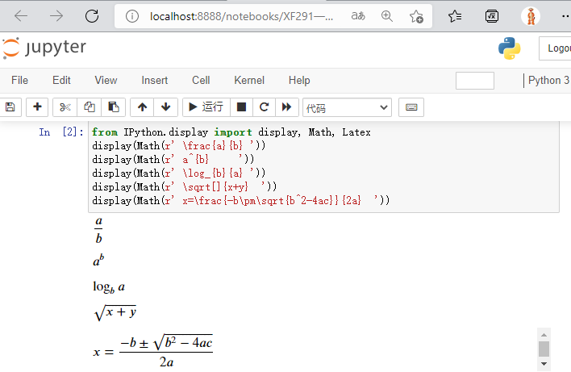
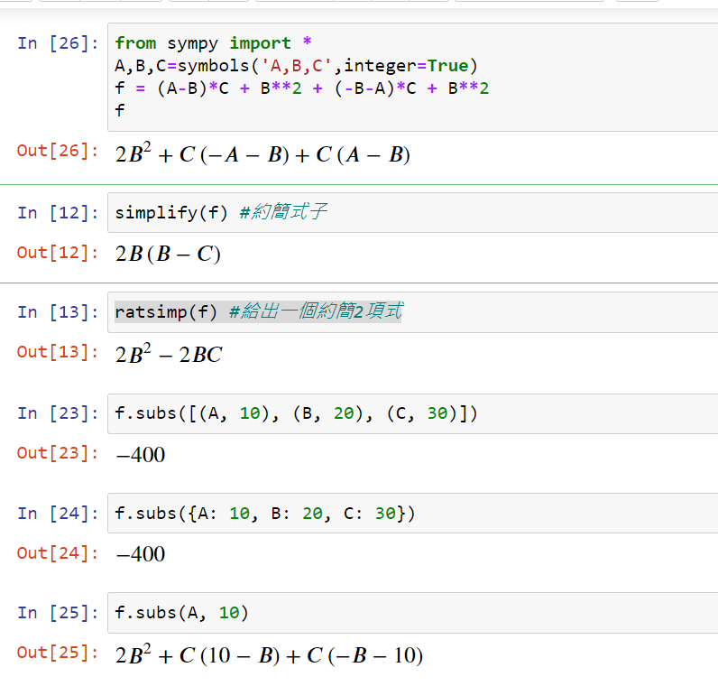
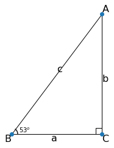

# 電腦與初級數學教學

電腦與初級數學教學應用,在中學階段教學中, 例如 Geogebra、 几何畫板、 三角函數建3D模型等, 引入課堂。在篇文章主要介紹Python在初級代數中表現, Python在科學運算中的優異性, 算式直觀地表逹, 零編程也可以學識Pyhton科學運算。預備工作可請資訊老師代勞以及測試工作環境,可以直接轉至初級數學知識點電腦運算方法。本章的程式代碼簡化便於理解, 具體代碼可以參考[README.ipynb](README.ipynb)和題型練習程式代碼。


## 一. 預備工作:  
預備可請資訊老師代為安裝測試。可以跳至第5點,簡單複製代碼,試用一下。
### 1. Python 3.9.x,以及第三方組件  
- https://www.python.org/   

下載安裝Python 3.9.x  
- 使用命令行指令 Win+R cmd  
```console
c:\Users\pi>pip install numpy sympy scipy matplotlib jupyterlab
```
### 2.工作環境, 命令行執行jupyter notebook   
```console
c:\Users\pi>jupyter notebook
```   


### 3.Latex 數學印刷體(MathJax網頁版)    
|          |          |          | 
|----------|----------|----------|
| 分數 a/b  | \frac{a}{b}   |   |
| 指數 a^b  | a^{b}    |      |
|對數 log(a,b) | \log_{b}{a}|     |
|開方 sqrt(x+y) | \sqrt[]{x+y}  |     |
|求根公式 | x=\frac{-b\pm\sqrt{b^2-4ac}}{2a}  ||    

jupyter notebook 實作一下數學印刷體    
```python
from IPython.display import display, Math, Latex
display(Math(r' \frac{a}{b}                       '))
display(Math(r' a^{b}                             '))
display(Math(r' \log_{b}{a}                       '))
display(Math(r' \sqrt[]{x+y}                      '))
display(Math(r' x=\frac{-b\pm\sqrt{b^2-4ac}}{2a}  '))
```    
     

### 4. numpy , sympy, scipy, matplotlib   
python 科學計算組件,主要使用sympy 代數符號運算, 及matplotlib的繪圖功能。      

### 5. sympy演示複雜式子   
```python   
from sympy import *           #註解: 使用組件sympy 
init_printing(use_latex='mathjax')      #註解: 顯示數學印刷體
x = Symbol('x')               #註解: x ,y 是代數符號
y = Symbol('y')
#註解: Rational有理數 3/2,  pi常數 ,  exp 是常數E的虛數I乘x次方, x**2即x平方.
Rational(3 ,2) * pi + E**(I*x) / (x**2 + y)  
```
```python   
(Rational(3 ,2) * pi + E**(I*x) / (x**2 + y)  ).subs({x:pi,y:7})
```


## 二. Sympy與初級數學知識點
### 代數符號的宣告
在Sympy中宣告代數符號有未知數x,y,z定義,為實數解； 整數k,m,n 定義； 函數f,g,h定義。
```python
from sympy import *
init_printing()
from IPython.display import Latex,HTML,Markdown  
x, y, z, t = symbols('x y z t',real=True) #為實數,解方程出現無解, 不會出現虛數解.
k, m, n = symbols('k m n', integer=True)
f, g, h = symbols('f g h', cls=Function)
```
### 1.有理數(Rational Number)運算
```python
from sympy import *
init_printing()
FractionNumber1=Rational(-3,4)  #註解: -3/4 分數表達1 Rational(a,b)
FractionNumber2=S('4/7')     #註解: 4/7  分數表達2  
Add(FractionNumber1 , FractionNumber2, evaluate=False)
```
   
```python
FractionNumber1 + FractionNumber2
```
   
```python
FractionNumber1 * FractionNumber2
```
   
```python
sqrt( FractionNumber2 )
```
   

### 2.整式
```python
from sympy import *
A,B,C=symbols('A,B,C',integer=True)
f = (A-B)*C + B**2 + (-B-A)*C + B**2
```
2*B**2 + C*(-A - B) + C*(A - B)    
```python
simplify(f)   #註解:約簡式子
```
2𝐵(𝐵−𝐶)   
```python
ratsimp(f)   #註解:約簡,給出二項式
```
2𝐵**2−2𝐵𝐶   
```python
f.subs({A: 10, B: 20, C: 30})   #註解: A,B,C代入數值
```
-400   
   

### 3.方程式
```python
from sympy import *
from sympy.abc import A, B, C, D

f=(A-B)*D + C**2 + (-B-A)*C+B**2
solve(f, A)
```

### 4 方程式組
```python
# 解二元二次方程組
import numpy as np                                #數字矩陣
import sympy as sp                                #sympy 簡易別名 sp    
sp.init_printing("mathjax")                       #sp.init_printing()  168 
x,y=sp.symbols('x,y')
p,q=np.random.choice(range(-10,10),2)
p=p if p!=0 else 1;q=q if q!=0 else 1;
b=p+q
c=p*q
eq1=sp.Eq(x+y,b)
eq2=sp.Eq(x*y,c)
St=[eq1,eq2]
Val=sp.solve([eq1,eq2],x,y)        
display(St)
display(Val)
```
[𝑥+𝑦=−12, 𝑥𝑦=35]  

[(−7, −5), (−5, −7)]   

### 5.不等式
```python
from sympy import *
from sympy.solvers.inequalities import solve_univariate_inequality
sp.init_printing("mathjax")   

x=Symbol('x')
St=(x +1)*(2*x-1) < 0
solve_univariate_inequality(St,x)      #solve_univariate_inequality 解不等式  
```


### 6.不等式組
```python
import numpy as np   
import sympy as sp                                
from sympy.solvers.inequalities import reduce_rational_inequalities
from IPython.display import display, Math, Latex
sp.init_printing("mathjax")                       
x=sp.symbols('x')

p,q=np.random.choice([-5,-4,-3,-2,-1,1,2,3,4,5],2)

fx1= x * 2 > p 
fx2= x - 9 < q 

display(Math(r"\left\{\begin{array}\\ %s \\ %s \\ \end{array}\right."%(sp.latex(fx1),sp.latex(fx2))))

reduce_rational_inequalities([[fx1,fx2]],x)   
```


### 7.數列和
```python
from sympy import *
i=Symbol('i')   
summation(i*2, (i, 1, 10))   
```
110
### 8.數列積
```python
from sympy import *
factorial(4)     #階乘
```
24   
```python
from sympy import *
k=symbols('k',integer=True)
product(k, (k, 1, 10) ) 
```
3628800   
### 9.函數圖像的性質
```python
from sympy import *
from sympy.plotting import plot
x,y=symbols('x y')

y = -(x+2)*(x+1)*(x-1)

plot(y, (x, -4, 4))

```


### 10.直角三角形
```python
import sympy as sp
from sympy.geometry import Point, Triangle, Segment
import matplotlib.pyplot as plt
from matplotlib.figure import Figure
t = Triangle(sss=(3, 4 , 5)) #53
plt.close('all')
fig = plt.figure()
ax = fig.add_subplot(1, 1, 1)
ax.set_aspect('equal')
ax.set_axis_off() 
ax.add_patch(plt.Polygon(t.vertices, fill=False))
ax.plot(*zip(*t.vertices), 'o')
plt.show()
```
簡化程序碼, 完整可參考[README.ipynb](README.ipynb)   



## 三.總結
Sympy在符號運算表現優異，初級數學以至引申至大專數學，都可以應用輔助學習及教學。數學老師在學習Sympy比資訊同事學習更快，理解更好，有能力自行設計出知識點練習題型。個人工作屬資訊專職，從Sympy技術層面，本章作為個人工作總結，數學老師回饋參考資料難以查找，提供中文版本參考。后續，不斷完善豊富內容，涵蓋中學階段數學知識點。

## 四.初級數學知識點題型練習

幫助同學,掌握不同類型題目:


- [PF101有理數運算.ipynb](PF101%E6%9C%89%E7%90%86%E6%95%B8%E9%81%8B%E7%AE%97.ipynb)
- [PF102整數指數冪運算.ipynb](PF102%E6%95%B4%E6%95%B8%E6%8C%87%E6%95%B8%E5%86%AA%E9%81%8B%E7%AE%97.ipynb)
- [PF103一元一次方程.ipynb](PF103%E4%B8%80%E5%85%83%E4%B8%80%E6%AC%A1%E6%96%B9%E7%A8%8B.ipynb)
- [PF104整式的加減法練習.ipynb](PF104%E6%95%B4%E5%BC%8F%E7%9A%84%E5%8A%A0%E6%B8%9B%E6%B3%95%E7%B7%B4%E7%BF%92.ipynb)
- [PF105二元一次方程.ipynb](PF105%E4%BA%8C%E5%85%83%E4%B8%80%E6%AC%A1%E6%96%B9%E7%A8%8B.ipynb)
- [PF106一元一次不等式.ipynb](PF106%E4%B8%80%E5%85%83%E4%B8%80%E6%AC%A1%E4%B8%8D%E7%AD%89%E5%BC%8F.ipynb)
- [PF107一元一次不等式組.ipynb](PF107%E4%B8%80%E5%85%83%E4%B8%80%E6%AC%A1%E4%B8%8D%E7%AD%89%E5%BC%8F%E7%B5%84.ipynb)
- [PF108整式的乘法練習.ipynb](PF108%E6%95%B4%E5%BC%8F%E7%9A%84%E4%B9%98%E6%B3%95%E7%B7%B4%E7%BF%92.ipynb)
- [PF201根式的運算.ipynb](PF201%E6%A0%B9%E5%BC%8F%E7%9A%84%E9%81%8B%E7%AE%97.ipynb)
- [PF2021整式的乘法公式完全平方公式.ipynb](PF2021%E6%95%B4%E5%BC%8F%E7%9A%84%E4%B9%98%E6%B3%95%E5%85%AC%E5%BC%8F%E5%AE%8C%E5%85%A8%E5%B9%B3%E6%96%B9%E5%85%AC%E5%BC%8F.ipynb)
- [PF202整式的乘法公式平方差v2.ipynb](PF202%E6%95%B4%E5%BC%8F%E7%9A%84%E4%B9%98%E6%B3%95%E5%85%AC%E5%BC%8F%E5%B9%B3%E6%96%B9%E5%B7%AEv2.ipynb)
- [PF203因式分解提公因式.ipynb](PF203%E5%9B%A0%E5%BC%8F%E5%88%86%E8%A7%A3%E6%8F%90%E5%85%AC%E5%9B%A0%E5%BC%8F.ipynb)
- [PF204分式的乘除.ipynb](PF204%E5%88%86%E5%BC%8F%E7%9A%84%E4%B9%98%E9%99%A4.ipynb)
- [PF205分式的加減.ipynb](PF205%E5%88%86%E5%BC%8F%E7%9A%84%E5%8A%A0%E6%B8%9B.ipynb)
- [PF206分式方程.ipynb](PF206%E5%88%86%E5%BC%8F%E6%96%B9%E7%A8%8B.ipynb)
- [PF207一次函數圖像的性質.ipynb](PF207%E4%B8%80%E6%AC%A1%E5%87%BD%E6%95%B8%E5%9C%96%E5%83%8F%E7%9A%84%E6%80%A7%E8%B3%AA.ipynb)
- [PF291一元二次方程式十字相乘法求因式.ipynb](PF291%E4%B8%80%E5%85%83%E4%BA%8C%E6%AC%A1%E6%96%B9%E7%A8%8B%E5%BC%8F%E5%8D%81%E5%AD%97%E7%9B%B8%E4%B9%98%E6%B3%95%E6%B1%82%E5%9B%A0%E5%BC%8F.ipynb)
- [PF292一元二次方程式求解.ipynb](PF292%E4%B8%80%E5%85%83%E4%BA%8C%E6%AC%A1%E6%96%B9%E7%A8%8B%E5%BC%8F%E6%B1%82%E8%A7%A3.ipynb)
- [PF293整式的乘法練習.ipynb](PF293%E6%95%B4%E5%BC%8F%E7%9A%84%E4%B9%98%E6%B3%95%E7%B7%B4%E7%BF%92.ipynb)
- [PF301一元二次方程式.ipynb](PF301%E4%B8%80%E5%85%83%E4%BA%8C%E6%AC%A1%E6%96%B9%E7%A8%8B%E5%BC%8F.ipynb)
- [PF302解可化為一元二次方程的分式方程.ipynb](PF302%E8%A7%A3%E5%8F%AF%E5%8C%96%E7%82%BA%E4%B8%80%E5%85%83%E4%BA%8C%E6%AC%A1%E6%96%B9%E7%A8%8B%E7%9A%84%E5%88%86%E5%BC%8F%E6%96%B9%E7%A8%8B.ipynb)
- [PF303解二元二次方程組.ipynb](PF303%E8%A7%A3%E4%BA%8C%E5%85%83%E4%BA%8C%E6%AC%A1%E6%96%B9%E7%A8%8B%E7%B5%84.ipynb)
- [PF304二次函數圖像的性質.ipynb](PF304%E4%BA%8C%E6%AC%A1%E5%87%BD%E6%95%B8%E5%9C%96%E5%83%8F%E7%9A%84%E6%80%A7%E8%B3%AA.ipynb)
- [PF305解直角三角形.ipynb](PF305%E8%A7%A3%E7%9B%B4%E8%A7%92%E4%B8%89%E8%A7%92%E5%BD%A2.ipynb)
- [PF306認識直角三角形函數.ipynb](PF306%E8%AA%8D%E8%AD%98%E7%9B%B4%E8%A7%92%E4%B8%89%E8%A7%92%E5%BD%A2%E5%87%BD%E6%95%B8.ipynb)
- [PF401高一一元二次不等式.ipynb](PF401%E9%AB%98%E4%B8%80%E4%B8%80%E5%85%83%E4%BA%8C%E6%AC%A1%E4%B8%8D%E7%AD%89%E5%BC%8F.ipynb)
- [PF402等差數列.ipynb](PF402%E7%AD%89%E5%B7%AE%E6%95%B8%E5%88%97.ipynb)
- [PF403等比數列.ipynb](PF403%E7%AD%89%E6%AF%94%E6%95%B8%E5%88%97.ipynb)
- [PF404對數運算基礎.ipynb](PF404%E5%B0%8D%E6%95%B8%E9%81%8B%E7%AE%97%E5%9F%BA%E7%A4%8E.ipynb)
- [PF501高二一元二次不等式.ipynb](PF501%E9%AB%98%E4%BA%8C%E4%B8%80%E5%85%83%E4%BA%8C%E6%AC%A1%E4%B8%8D%E7%AD%89%E5%BC%8F.ipynb)
- [PF601高三餘式定理.ipynb](PF601%E9%AB%98%E4%B8%89%E9%A4%98%E5%BC%8F%E5%AE%9A%E7%90%86.ipynb)
- [PF602.線性規劃.ipynb](PF602.%E7%B7%9A%E6%80%A7%E8%A6%8F%E5%8A%83.ipynb)
- [PF603.乘法公式190404.ipynb](PF603.%E4%B9%98%E6%B3%95%E5%85%AC%E5%BC%8F190404.ipynb)
- [PF604.一元二次方程190305.ipynb](PF604.%E4%B8%80%E5%85%83%E4%BA%8C%E6%AC%A1%E6%96%B9%E7%A8%8B190305.ipynb)
- [PF605.三角函数同角变换190410.ipynb](PF605.%E4%B8%89%E8%A7%92%E5%87%BD%E6%95%B0%E5%90%8C%E8%A7%92%E5%8F%98%E6%8D%A2190410.ipynb)

### 五.參考

https://docs.sympy.org/latest/index.html

https://www.sympygamma.com/

https://austinrochford.com/posts/2014-02-05-eulers-formula-sympy.html


